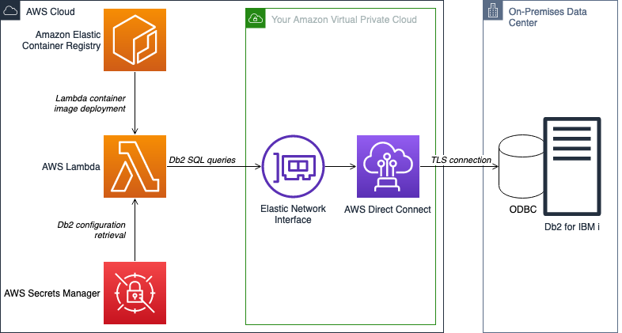
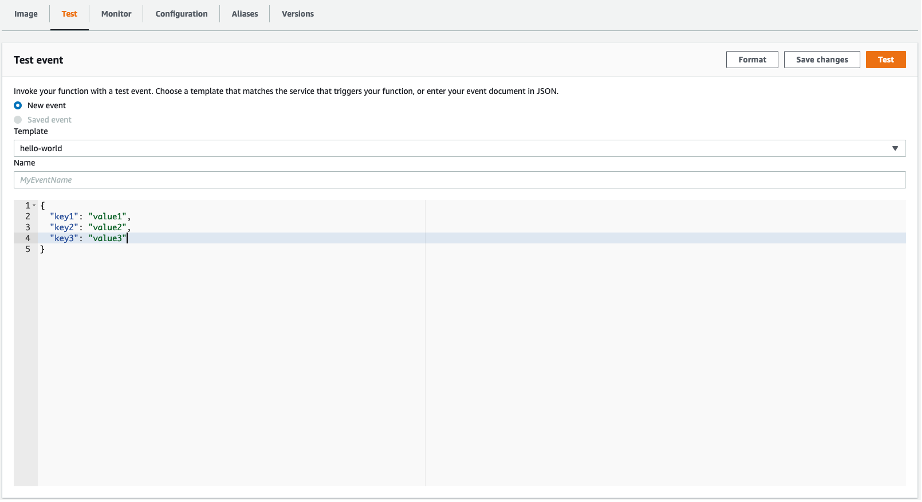
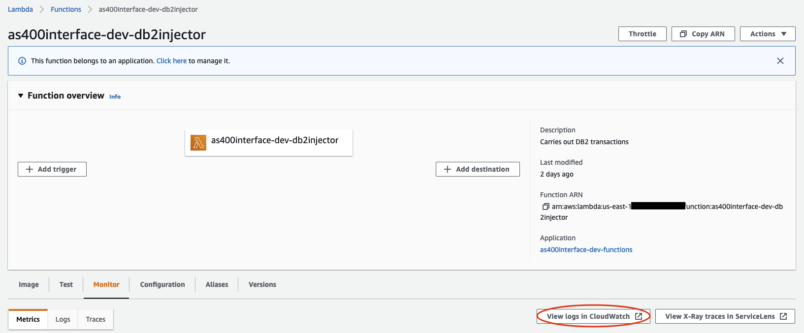
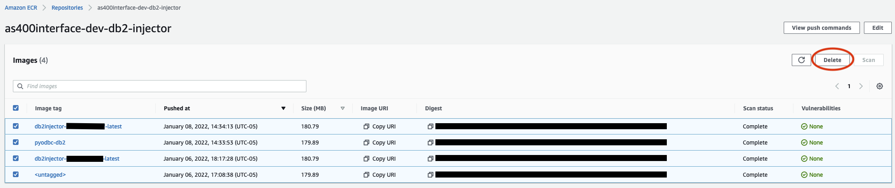

# AWS Lambda Interface for Db2 for IBM i

This repository contains the infrastructure required to interface with Db2 for IBM i databases. Demo code for example SQL queries is included.

## Overview

This architecture provides a generic solution for Db2 interfacing, without any application-specific triggers. It allows us to push Docker images to a repository hosted on ECR and deploy those images to a Lambda function. Lambda can then execute specified queries on a target Db2. Note that the Lambda invocation trigger, the VPC, and Direct Connect are not included in the AWS resources launched in this blog post, but may be necessary depending on your use case. Prerequisites are described the walkthrough.


## Components

* `bin`: Helper scripts, see next section for details.
* `functions`: Lambda function code that contains logic for interfacing with Db2.
* `images`: Base Docker images that need to built and uploaded for functions to use.
* `infrastructure`: Additional CloudFormation templates.
* `res`: Additional supporting resources.

### Scripts

A set of helper scripts are available in the `bin` folder to perform deployment operations. The AWS CLI should be properly configured in the terminal before you execute scripts. Environment variables are required; see `bin/example.env` for details. The scripts are as follows:

* `build-functions.py`: Package the Lambda function Docker images defined in the `functions` folder and uploads them to the ECR repository. Uses SAM and Docker under the hood. Writes the translated plain-vanilla CloudFormation template out to `.aws-sam/build/functions.yaml`.
* `cleanup.bash`: Bash wrapper for cleanup script to provide environment variables.
* `cleanup.py`: Cleanup script to delete ECR images and infrastructure deployed from `deploy.bash`
* `common`: Functions shared between all scripts.
* `config-db2.py`: Prompts for database connection information and then writes it to secrets manager.
* `deploy-base.py`: Deploys the base infrastructure (e.g. ECR repository, DB2 configuration secret).
* `deploy-functions.py`: Loads the template produced by `build-functions.py` and deploys it.
* `deploy.bash`: Runs all of the deploy scripts in sequence. Takes one parameter, a path to an environment file. If none is provided, `.env` is used as a default.

## Deployment Instructions

The deployment instructions provided here will launch an ECR repository, a Secrets Manager secret, a Lambda function built off images uploaded to the aforementioned ECR repo, and associated ENIs for VPC access. The deployment is automated using bash and Python scripts.

### Prerequisites

* Clone [code repository](https://gitlab.aws.dev/basillin/aws-lambda-interface-for-db2-i) locally
* An [AWS account](https://aws.amazon.com/)
* [AWS CLI access](https://docs.aws.amazon.com/cli/latest/userguide/install-cliv2.html)
* [Python 3](https://www.python.org/downloads/) installed
* [Pip](https://pip.pypa.io/en/stable/installation/) installed
* [Docker](https://www.docker.com/products/docker-desktop) installed
* [AWS SAM](https://aws.amazon.com/serverless/sam/)
* [PyYAML](https://pypi.org/project/PyYAML/)
* [AWS Sam Translator](https://pypi.org/project/aws-sam-translator/)
* [IBM iAccess ODBC driver RPM package](https://www.ibm.com/support/pages/ibm-i-access-client-solutions) downloaded
* VPC connectivity to Db2
* At least 2 private subnets for HA
* Basic Unix CLI knowledge
* A bash shell environment for script execution
* Service account credentials for Db2

### Provision IBM iAccess Driver

1. Retrieve a copy of the [IBM iAccess ODBC driver RPM package](https://www.ibm.com/support/pages/ibm-i-access-client-solutions). You may have to contact your Db2 DBA for access.
1. Copy your downloaded IBM iAccess driver to `/aws-lambda-interface-for-db2-i/images/pyodbc-db2/lib/`. Create the `lib` folder if it does not exist.

### Set Environment Variables

1. Navigate to `/aws-lambda-interface-for-db2-i/bin/` and copy the example.env file to a new file named `.env`.
1. Open the new .env file with an editor. Configure the environment variables found in the file as appropriate:
    |   Variable Name    |                                                                                   Description                                                                                   |
    | :----------------: | :-----------------------------------------------------------------------------------------------------------------------------------------------------------------------------: |
    | `ENVIRONMENT_NAME` |                                                  An identifier used to classify an environment, such as test, dev, uat, prod.                                                   |
    |   `PROJECT_NAME`   | The name of the project. This will control naming convention across stacks and resources. This should be a lowercase alphanumeric value to pass ECR repository name validation. |
    |    `SUBNET_IDS`    |                 Comma-separated list of subnet IDs within the above VPC that are routable to the Db2 instance. You should include at least 2 from separate AZs.                 |
    |      `VPC_ID`      |                                                          VPC ID for the network that is routable to the Db2 instance.                                                           |

### Run Deployment Script

1. Ensure that Docker is running locally.
1. Ensure that your AWS environment is configured correctly. You can check if you are configured with the correct environment by running the following command: `aws sts get-caller-identity --query 'Account' --output text`. The command will output an account number – make sure that this account number is consistent with the account you wish to deploy to. For more information, see how to configure [AWS CLI access](https://docs.aws.amazon.com/cli/latest/userguide/install-cliv2.html).
1. Execute `/aws-lambda-interface-for-db2-i/bin/deploy.bash`.

### Configure Secrets Manager Secret Details

1. The deployment script will ask you for secret values. It will display the secret key, the current value (with password masked) and allow you to enter a new value. You can continue to use the old value by simply proceeding with the Enter key.
1. You must populate the keys with an appropriate value:
    | Secret Name |             Description              |
    | :---------: | :----------------------------------: |
    |  `Schema`   |         Database schema name         |
    | `Hostname`  | Hostname (or IP address) of database |
    | `Database`  |            Database name             |
    | `Password`  |       Service account password       |
    | `Username`  |       Service account username       |
1. The project will now build and deploy. This will take some time. You can check live deployment status by viewing the stack status and Events tab in the [CloudFormation console](https://console.aws.amazon.com/cloudformation/). Allow up to 30 minutes for deployment.

## Modifications for Further Use

Now that you have deployed the infrastructure, you can begin to make meaningful code, logic, and other architectural modifications to adapt the solution to real-world use cases.

### Lambda Invocation Modifications

While this blog deploys the necessary infrastructure for basic interfacing, it excludes any Lambda invocation mechanisms, as this will vary based on your use case.

1. To make modifications to invocation infrastructure, make changes in the `/aws-lambda-interface-for-db2-i/infrastructure/` folder. You can add CloudFormation templates for any additional infrastructure here, or modify the existing stack. If you add new files, ensure that you modify the existing deployment scripts accordingly.
1. Alternatively, you can manually create resources in the AWS console, and then manually link them in the console as well. Instructions vary by [trigger type](https://docs.aws.amazon.com/lambda/latest/dg/lambda-invocation.html).

### Code and Logic Modifications

1. Code for the transaction logic can be found in `/aws-lambda-interface-for-db2-i/functions/db2-injector/src/`:
    * `main.py` – Contains Lambda handler to perform custom logic with Lambda invocation. In the provided example file, we start the connection to Db2 and execute two dummy queries.
    * `base.py` – Contains helper methods to construct and execute queries
1. You can modify and extend to the existing tables and queries in these files. As seen in the `base.py` example, you can create a dictionary of table names and a list of SQL queries. The `_construct_methods()` method in `base.py` will formulate methods for the queries so that any query defined in the `_query_methods` list is callable by its name attribute.
    * The `_table_names` dictionary contains the names of Db2 tables to target for your queries. This is structured like so:

        ```py
        _table_names = {
            "table_name_1": "EXAMPLE1",
            "table_name_2": "EXAMPLE2",
        }
        ```

      * The keys for the dictionary refer to the Python variable name for the table, whereas the value is the actual table name in Db2.

    * The `_query_methods` list contains a list of dictionaries for each query with additional metadata, and is formulated like so:

        ```py
        _query_methods = [
            {
                "name": "_example_select_query",
                "base": "_execute_transaction",
                "table": "table_name_1",
                "query": """
                SELECT FROM {0}.{1} WHERE ATTRIBUTE_1 = ? AND ATTRIBUTE_2 = ?
                """,
            },
            {
                "name": "_example_delete_query",
                "base": "_execute_transaction",
                "table": "table_name_2",
                "query": """
                DELETE FROM {0}.{1} WHERE ATTRIBUTE_1 = ? AND ATTRIBUTE_2 = ?
                """,
            },
        ]
        ```

        As shown, each query dictionary in the list contains a name, base, table, and query attribute. The attributes refer to the following:
        | Attribute Name |                                                                                                                                                       Description                                                                                                                                                       |
        | :------------: | :---------------------------------------------------------------------------------------------------------------------------------------------------------------------------------------------------------------------------------------------------------------------------------------------------------------------: |
        |     `name`     |                                                                                                                         The name of the invocation method once the query has been constructed.                                                                                                                          |
        |     `base`     |                        The base function to use for the query. Typically, transactions are invoked using the `_execute_transaction()` function, but you can write custom functions to add functionality to your transaction responses, such as formatting strings returned in `SELECT` queries.                         |
        |    `table`     |                                                                                                         The table name to perform your query on. This will be one of the keys in the `_table_names` dictionary.                                                                                                         |
        |    `query`     | The query string to use. The string will be replaced with the schema and table names, as well as any additional parameters you provide as arguments during method invocation. In the format above,  `{0}` refers to the schema,  `{1}` refers to the table, and  `?` refers to each parameter given, in relative order. |

1. You can instantiate your query object by passing the global connection and schema variables to the object initializer. You can then invoke query execution directly by calling the name attribute of each query listed in `_query_methods`. Lines 41 and 42 of `main.py` provide an example. Print the results of the query to check them later.
1. Finally, to deploy your modifications, execute the deployment script `/aws-lambda-interface-for-db2-i/bin/deploy.bash` again. You can skip secret value entry by proceeding with the Enter key.
1. All subsequent modifications to code in `/aws-lambda-interface-for-db2-i/functions/db2-injector/src/` require re-running the deployment script. The script will only affect updated components. Ensure

## Testing Connectivity

Once modified and deployed, we can finally test our connectivity by simply invoking our Lambda function.

### Test Invocation

1. Ensure that during testing, your code is only set to run queries that will not perform critical operations on your database. For example, use a read-only operation such as `SELECT`. You can print the response of your query to check for connectivity.
1. If you do not have any additional trigger infrastructure deployed, you can simply [invoke your function manually](https://docs.aws.amazon.com/lambda/latest/dg/getting-started-create-function.html#get-started-invoke-manually) by navigating to the Lambda console and sending any well-formed test event, provided that your Lambda handler does not currently have custom logic to handle event payloads. Click the **Test** button to send the payload and invoke your Lambda function.


### Checking Connectivity

1. Check connectivity by viewing the [CloudWatch logs](https://docs.aws.amazon.com/lambda/latest/dg/monitoring-cloudwatchlogs.html) for your Lambda function after invocation. If you cannot find the log group, you can open the logs from the Lambda console under the Monitor tab. Click on the View logs in CloudWatch button, and then select the most recent log stream.

1. Once you are viewing the correct log stream, check the logs to see if the printed values match the expected results from your custom queries. Should the connection or query fail, you will see an exception message.

### Troubleshooting

The following table provides common issues and solutions.
|                  Issue                  |                                                                                                Tips                                                                                                 |
| :-------------------------------------: | :-------------------------------------------------------------------------------------------------------------------------------------------------------------------------------------------------: |
|          No logs in CloudWatch          |                                                            Wait a couple minutes and refresh - CloudWatch logs can lag slightly behind.                                                             |
|                                         |                                                                          Check to see if you are in the correct log group.                                                                          |
|                                         |                  Check [Lambda CloudWatch metrics](https://docs.aws.amazon.com/lambda/latest/dg/monitoring-functions-access-metrics.html) to see if the function has been invoked.                  |
| Logs show `SQLDriverConnect` exceptions |                                     Verify that your [Secrets Manager](https://console.aws.amazon.com/secretsmanager) credentials and configuration is correct                                      |
|                                         |              Test connectivity to Db2 with an EC2 instance in the same environment. Install a database client such as [DBeaver](https://dbeaver.io/), and then try to connect from it.              |
|                                         | Verify that your target VPC and subnets have [correct network configurations](https://docs.aws.amazon.com/vpc/latest/userguide/VPC_Route_Tables.html) to make connections out to your Db2 database. |
|                                         |              Check with your DBA to see if service credentials are locked or expired. Multiple connection attempts with incorrect credentials could cause a credential freeze on Db2.               |
|                                         |                                   Look up common [TCP/IP communication errors](https://www.ibm.com/docs/en/db2/11.5?topic=errors-sql30081n-tcpip-communication).                                    |
|  Logs show `SQLExecDirectW` exceptions  |                                                    Your query may not be well formed - double check to ensure that your query syntax is correct.                                                    |
|                                         |                                                                Check that the schema, table, and any parameters passed are correct.                                                                 |
|                                         |                                              Look up error code in [SQLSTATE Messages](https://www.ibm.com/docs/en/db2/11.5?topic=messages-sqlstate).                                               |

## Cleaning Up

To avoid incurring future charges, delete Docker images and all resources created by this stack if not in use.

### Automated Deletion

You can automate stack deletion by running the provided cleanup script:

1. Execute the `/aws-lambda-interface-for-db2-i/bin/cleanup.bash` script. Note that this will remove everything previously deployed, including the Lambda function, IAM role, secret, Docker images, and ECR repository. The stack deletion can take [upwards of 45 minutes](https://aws.amazon.com/premiumsupport/knowledge-center/lambda-delete-cloudformation-stack/) to complete due to the ENIs created. This will not modify your code changes.

### Manual Deletion

You can also manually delete the stacks:

1. Delete images from the your ECR repository
    1. Navigate to the [ECR console](https://console.aws.amazon.com/ecr/home/).
    1. Select all images hosted in your repository created as part of this stack
    1. Select **Delete**
    
2. Delete the CloudFormation stacks
    1. Navigate to the [CloudFormation console](https://console.aws.amazon.com/cloudformation/).
    1. Delete the stacks titled `[project]-[environment]-functions` and `[project]-[environment]-base`. The order in which you delete the stacks does not matter.
    1. The `[project]-[environment]-functions` stack deletion can take [upwards of 45 minutes](https://aws.amazon.com/premiumsupport/knowledge-center/lambda-delete-cloudformation-stack/) to complete due to the ENIs created.

## Security

See [CONTRIBUTING](CONTRIBUTING.md#security-issue-notifications) for more information.

## License

This project is licensed under the Apache-2.0 License.
Db2 and IBM are trademarks of International Business Machines Corporation.
